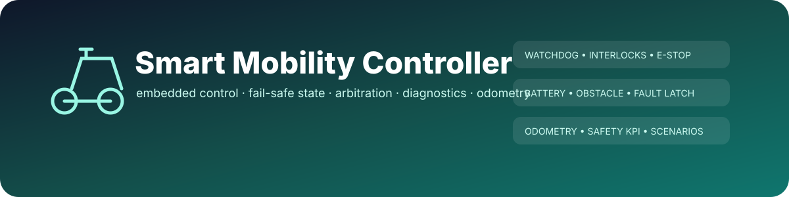
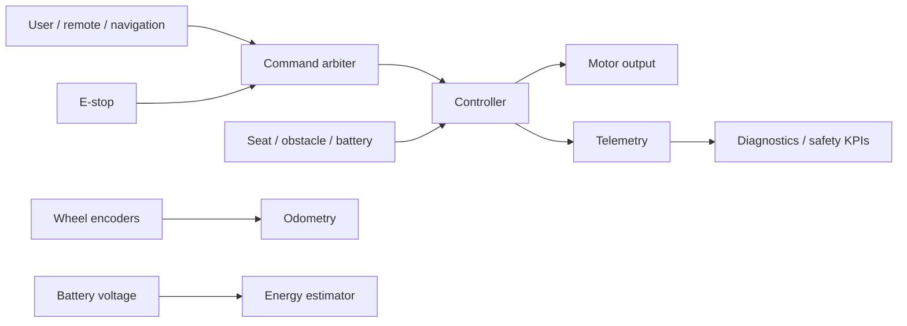

<div align="center">
  

  [](https://github.com/shiv814/smart-mobility-controller/actions/workflows/build.yml)
  
  
  

  **A safety-oriented C++17 motion-control core and Arduino integration prototype with fail-safe state handling, command arbitration, drive-mode control, obstacle/battery interlocks, odometry, energy estimation, diagnostics and deterministic scenario testing.**
</div>

> [!CAUTION]
> **Engineering portfolio prototype only.** This repository is not certified medical-device or powered-mobility software. Real hardware requires formal hazard analysis, redundant safety mechanisms, hardware interlocks, electrical/mechanical review, verification, validation and regulatory compliance.

---

## Why this project is different

A motor demo becomes an engineering project when it answers uncomfortable questions: What happens when commands stop arriving? Can forward become reverse instantly? What wins if autonomous and user commands conflict? How does an emergency input preempt everything? What happens near an obstacle or at critical battery voltage? How can a test prove those transitions are deterministic?

Version 3 builds around those questions rather than around feature count.

## Capability map

| Layer | Capabilities |
|---|---|
| Motion control | discrete commands, differential joystick mixing, PWM targets and brake output |
| Drive profiles | Eco, Normal and Sport scaling with independent acceleration/deceleration |
| Direction safety | braking before motor-direction reversal |
| Watchdog | stale commands force a safe stopped state |
| Environment | obstacle slowdown/stop and nearest-obstacle telemetry |
| Power | low-voltage derating, critical-battery latch, SOC/reserve/range estimate |
| Interlocks | emergency-stop, seat occupancy and sensor-validity behavior |
| Fault state | latched critical faults with explicit safe clearing conditions |
| Arbitration | priority + TTL requests from user, navigation and remote sources; emergency override |
| Odometry | differential-drive pose/distance estimate from encoder ticks |
| Diagnostics | safety-state exposure, timeouts, interventions, min battery/obstacle and JSON KPIs |
| Simulation | deterministic CSV scenario runner plus v3 standalone feature demo |
| Hardware boundary | Arduino I/O sketch wraps the portable host-tested controller |

## Architecture



## Quick start

```bash
git clone https://github.com/shiv814/smart-mobility-controller.git
cd smart-mobility-controller
cmake -S . -B build -DCMAKE_BUILD_TYPE=Release
cmake --build build --config Release
ctest --test-dir build -C Release --output-on-failure
```

Run the deterministic scenario simulator with `examples/safety_scenario.csv`, or run the v3 module demo:

```bash
./build/mobility_v3_demo
```

## Command arbitration

`CommandArbiter` accepts time-bounded requests with source, priority, issuance time and TTL. Expired commands disappear, highest valid priority wins, ties prefer the newest command, and emergency stop bypasses normal arbitration. If nothing is valid, the fallback is Stop.

This deliberately avoids letting a stale autonomous command survive forever.

## Energy and reserve estimation

`EnergyEstimator` converts pack voltage into a bounded state-of-charge estimate, preserves a configurable energy reserve, and estimates range using either recent or nominal Wh/km. It is transparent and tunable; it is not presented as a battery-management system.

## Differential odometry

`DifferentialOdometry` integrates left/right encoder deltas using track width, wheel diameter and ticks/revolution. The output is a local planar estimate (`x`, `y`, heading, cumulative distance), suitable for simulation/telemetry—not safety-rated localization.

## Safety diagnostics

`DiagnosticMonitor` is read-only with respect to the controller. It summarizes operational exposure instead of changing motor state: ready/degraded/stopped/fault frames, timeouts, actual speed interventions, minimum observed obstacle/battery, fault counts and a simple safety-availability ratio.

## Repository map

```text
src/
  controller.*     portable motion + safety state machine
  simulator.cpp    CSV scenario simulator
  arbitration.*    multi-source command arbitration
  energy.*         SOC / reserve / range estimator
  odometry.*       differential-drive state estimate
  diagnostics.*    safety KPI aggregation
  v3_demo.cpp      v3 feature smoke/demo
arduino/            hardware integration sketch
examples/           deterministic scenario inputs
tests/              controller and v3 safety tests
docs/               architecture, hazards and validation strategy
```

## Safety documentation

- [Architecture](docs/ARCHITECTURE.md)
- [Prototype hazard analysis](docs/HAZARD_ANALYSIS.md)
- [Validation strategy](docs/VALIDATION.md)
- [Contributing](CONTRIBUTING.md)

The hazard document is intentionally explicit about controls **not** implemented in software. A strong safety project should document its boundaries, not hide them.

## Verification

CI builds Debug and Release on Linux, Windows and macOS and executes the original controller tests, v3 safety-module tests, and the v3 demo smoke test.

## License
MIT © Shivam Patel
