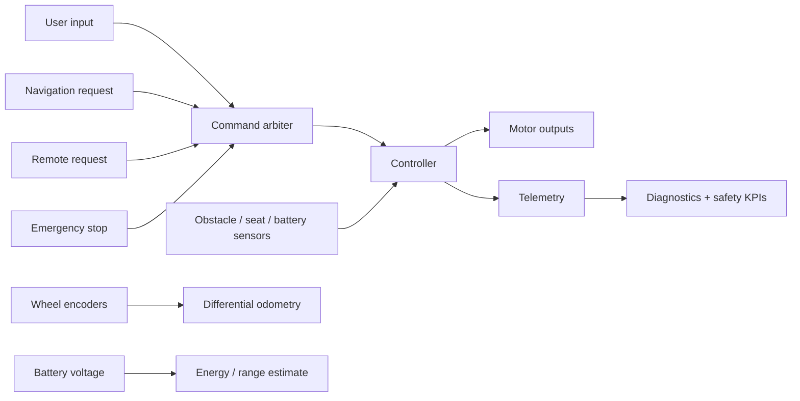

# Smart Mobility Controller Architecture

The project separates **motion control**, **safety policy**, **command arbitration**, **state estimation**, and **diagnostics** so safety-critical decisions are not hidden inside a single monolithic loop.

## Control core

`Controller` remains responsible for drive mode scaling, differential joystick mixing, acceleration/deceleration, reversal braking, command watchdogs, obstacle response, battery derating and latched safety faults.

## Command arbitration

`CommandArbiter` chooses among time-bounded requests from user, navigation and remote sources by priority and recency. An emergency-stop input bypasses normal arbitration and returns Stop.

## State estimation

`DifferentialOdometry` converts cumulative wheel encoder ticks into an estimated planar pose using midpoint integration. `EnergyEstimator` converts pack voltage into a deliberately simple state-of-charge/range estimate with a configurable reserve.

## Diagnostics

`DiagnosticMonitor` consumes controller telemetry without mutating controller state. It records ready/degraded/stopped/fault frames, timeout exposure, obstacle interventions, minimum observed battery/obstacle values and a simple safety-availability ratio.
